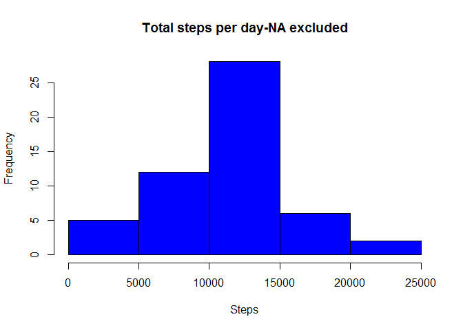
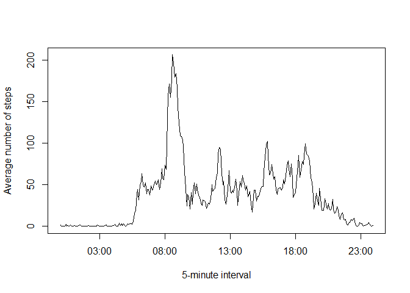
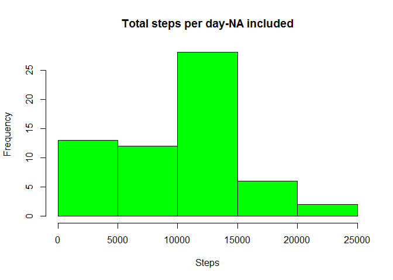
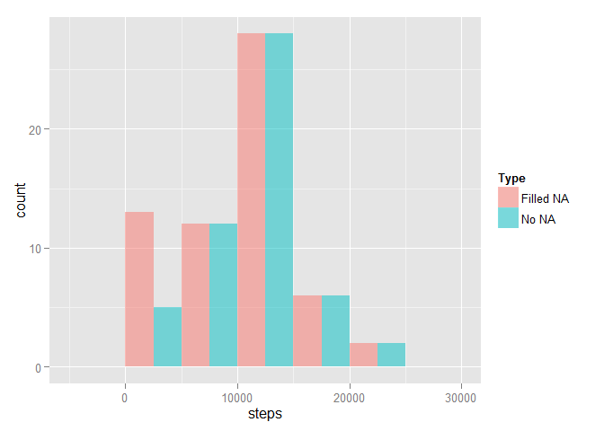
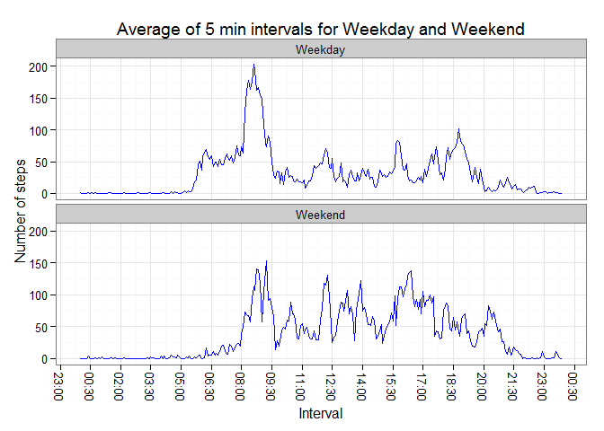

# Reproducible Research: Peer Assessment 1
##Introduction
The objective of this document is to explain and answer to the assignment questions of the Peer
assignment of [Reproducible Research](https://www.coursera.org/course/repdata) course.
Before loading the data, a series of library and system defaults are set up.

```r
Sys.setlocale("LC_TIME", "English") ##set Days name in english
library(lubridate)
library(xtable)
library(dplyr)
library(ggplot2)
library(scales)
```

## Loading and preprocessing the data

The data set for the analysis is named [Activity monitoring data](https://d396qusza40orc.cloudfront.net/repdata%2Fdata%2Factivity.zip) [52k]. The data are collected from wereables devices such as Fitbit or Nike Fuelband.   

The variables included in this dataset are:

* steps: Number of steps taking in a 5-minute interval (missing values are coded as NA)

* date: The date on which the measurement was taken in YYYY-MM-DD format

* interval: Identifier for the 5-minute interval in which measurement was taken

The dataset is stored in a comma-separated-value (CSV) file and there are a total of 17,568 observations in this dataset.


```r
dataUrl<-"https://d396qusza40orc.cloudfront.net/repdata%2Fdata%2Factivity.zip"
if (!file.exists("activity.zip")) {
        download.file(url = dataUrl, destfile ="activity.zip", mode='wb', cacheOK=FALSE)
}
raw_data<-read.csv(file = unzip(zipfile="activity.zip"))
raw_data$date <- as.Date(raw_data$date, "%Y-%m-%d")
```
The data set obtained is then the following:

```
##   steps       date interval
## 1    NA 2012-10-01        0
## 2    NA 2012-10-01        5
## 3    NA 2012-10-01       10
## 4    NA 2012-10-01       15
## 5    NA 2012-10-01       20
## 6    NA 2012-10-01       25
```

## What is mean total number of steps taken per day?
For this part of assignent it is possible to ignore the missing values. As first step we calculate for each day the total number of steps, that can be seen in the table below

```r
Total_Step1 <-aggregate(steps ~ date, data = raw_data, sum, na.rm = TRUE)
Total_Step1$date<-format(Total_Step1$date,"%a %b %d")

a<-xtable(Total_Step1,align = c("c","c","c"),label = 1)
print(a,type="html",include.rownames=FALSE)
```

<!-- html table generated in R 3.2.0 by xtable 1.7-4 package -->
<!-- Wed May 06 14:31:25 2015 -->
<table border=1>
<tr> <th> date </th> <th> steps </th>  </tr>
  <tr> <td align="center"> Tue Oct 02 </td> <td align="center"> 126 </td> </tr>
  <tr> <td align="center"> Wed Oct 03 </td> <td align="center"> 11352 </td> </tr>
  <tr> <td align="center"> Thu Oct 04 </td> <td align="center"> 12116 </td> </tr>
  <tr> <td align="center"> Fri Oct 05 </td> <td align="center"> 13294 </td> </tr>
  <tr> <td align="center"> Sat Oct 06 </td> <td align="center"> 15420 </td> </tr>
  <tr> <td align="center"> Sun Oct 07 </td> <td align="center"> 11015 </td> </tr>
  <tr> <td align="center"> Tue Oct 09 </td> <td align="center"> 12811 </td> </tr>
  <tr> <td align="center"> Wed Oct 10 </td> <td align="center"> 9900 </td> </tr>
  <tr> <td align="center"> Thu Oct 11 </td> <td align="center"> 10304 </td> </tr>
  <tr> <td align="center"> Fri Oct 12 </td> <td align="center"> 17382 </td> </tr>
  <tr> <td align="center"> Sat Oct 13 </td> <td align="center"> 12426 </td> </tr>
  <tr> <td align="center"> Sun Oct 14 </td> <td align="center"> 15098 </td> </tr>
  <tr> <td align="center"> Mon Oct 15 </td> <td align="center"> 10139 </td> </tr>
  <tr> <td align="center"> Tue Oct 16 </td> <td align="center"> 15084 </td> </tr>
  <tr> <td align="center"> Wed Oct 17 </td> <td align="center"> 13452 </td> </tr>
  <tr> <td align="center"> Thu Oct 18 </td> <td align="center"> 10056 </td> </tr>
  <tr> <td align="center"> Fri Oct 19 </td> <td align="center"> 11829 </td> </tr>
  <tr> <td align="center"> Sat Oct 20 </td> <td align="center"> 10395 </td> </tr>
  <tr> <td align="center"> Sun Oct 21 </td> <td align="center"> 8821 </td> </tr>
  <tr> <td align="center"> Mon Oct 22 </td> <td align="center"> 13460 </td> </tr>
  <tr> <td align="center"> Tue Oct 23 </td> <td align="center"> 8918 </td> </tr>
  <tr> <td align="center"> Wed Oct 24 </td> <td align="center"> 8355 </td> </tr>
  <tr> <td align="center"> Thu Oct 25 </td> <td align="center"> 2492 </td> </tr>
  <tr> <td align="center"> Fri Oct 26 </td> <td align="center"> 6778 </td> </tr>
  <tr> <td align="center"> Sat Oct 27 </td> <td align="center"> 10119 </td> </tr>
  <tr> <td align="center"> Sun Oct 28 </td> <td align="center"> 11458 </td> </tr>
  <tr> <td align="center"> Mon Oct 29 </td> <td align="center"> 5018 </td> </tr>
  <tr> <td align="center"> Tue Oct 30 </td> <td align="center"> 9819 </td> </tr>
  <tr> <td align="center"> Wed Oct 31 </td> <td align="center"> 15414 </td> </tr>
  <tr> <td align="center"> Fri Nov 02 </td> <td align="center"> 10600 </td> </tr>
  <tr> <td align="center"> Sat Nov 03 </td> <td align="center"> 10571 </td> </tr>
  <tr> <td align="center"> Mon Nov 05 </td> <td align="center"> 10439 </td> </tr>
  <tr> <td align="center"> Tue Nov 06 </td> <td align="center"> 8334 </td> </tr>
  <tr> <td align="center"> Wed Nov 07 </td> <td align="center"> 12883 </td> </tr>
  <tr> <td align="center"> Thu Nov 08 </td> <td align="center"> 3219 </td> </tr>
  <tr> <td align="center"> Sun Nov 11 </td> <td align="center"> 12608 </td> </tr>
  <tr> <td align="center"> Mon Nov 12 </td> <td align="center"> 10765 </td> </tr>
  <tr> <td align="center"> Tue Nov 13 </td> <td align="center"> 7336 </td> </tr>
  <tr> <td align="center"> Thu Nov 15 </td> <td align="center">  41 </td> </tr>
  <tr> <td align="center"> Fri Nov 16 </td> <td align="center"> 5441 </td> </tr>
  <tr> <td align="center"> Sat Nov 17 </td> <td align="center"> 14339 </td> </tr>
  <tr> <td align="center"> Sun Nov 18 </td> <td align="center"> 15110 </td> </tr>
  <tr> <td align="center"> Mon Nov 19 </td> <td align="center"> 8841 </td> </tr>
  <tr> <td align="center"> Tue Nov 20 </td> <td align="center"> 4472 </td> </tr>
  <tr> <td align="center"> Wed Nov 21 </td> <td align="center"> 12787 </td> </tr>
  <tr> <td align="center"> Thu Nov 22 </td> <td align="center"> 20427 </td> </tr>
  <tr> <td align="center"> Fri Nov 23 </td> <td align="center"> 21194 </td> </tr>
  <tr> <td align="center"> Sat Nov 24 </td> <td align="center"> 14478 </td> </tr>
  <tr> <td align="center"> Sun Nov 25 </td> <td align="center"> 11834 </td> </tr>
  <tr> <td align="center"> Mon Nov 26 </td> <td align="center"> 11162 </td> </tr>
  <tr> <td align="center"> Tue Nov 27 </td> <td align="center"> 13646 </td> </tr>
  <tr> <td align="center"> Wed Nov 28 </td> <td align="center"> 10183 </td> </tr>
  <tr> <td align="center"> Thu Nov 29 </td> <td align="center"> 7047 </td> </tr>
   <a name=1></a>
</table>
  
     
The histogram plot of the total steps per day is shown below:

```r
hist(Total_Step1$steps,xlab = "Steps",col = "blue",main ="Total steps per day-NA excluded" )
```




The mean of the total mean is equal to **10766** , while the median is equal to **10765**.  


## What is the average daily activity pattern?
In order to represent the average daily activity it is computed the mean steps taken on each 5 minute interval. In the plot below can be seen the activity.


```r
raw_data$interval <- as.POSIXct(strptime(sprintf("%04d", raw_data$interval), "%H%M"))
step_int<-aggregate(steps ~ interval, data = raw_data,FUN = mean, na.rm = TRUE)
plot(step_int$interval,step_int$steps,type="n",
     xlim = c(min(step_int$interval),max(step_int$interval)),
     ylab = "Average number of steps",
     xlab="5-minute interval")
lines(step_int$interval,step_int$steps, col = "black" )
```



```r
maxim<-step_int[which.max(step_int$steps),]
```
 
The maximum of the average steps is equal to **206.17** and it happen around   **08:35** in the morning.


## Imputing missing values

In al the analysis performed till now missing values where removed. Since this can add some bias to the analysis, first of all an estimation of the missing values is performed.

```r
table(is.na(raw_data))
```

```
## 
## FALSE  TRUE 
## 50400  2304
```

The total number of missing values is equal to **2304**.  
This value is about  **4.37%** of the total number of observation. It should then not have a great impact on the data.       
In any case it is important to understand the distribution of the missing values, in order to define a strategy to replace fill them. The distribuition of the missing values is shown in the table below: 

```r
table(raw_data$date,is.na(raw_data$steps))
```

```
##             
##              FALSE TRUE
##   2012-10-01     0  288
##   2012-10-02   288    0
##   2012-10-03   288    0
##   2012-10-04   288    0
##   2012-10-05   288    0
##   2012-10-06   288    0
##   2012-10-07   288    0
##   2012-10-08     0  288
##   2012-10-09   288    0
##   2012-10-10   288    0
##   2012-10-11   288    0
##   2012-10-12   288    0
##   2012-10-13   288    0
##   2012-10-14   288    0
##   2012-10-15   288    0
##   2012-10-16   288    0
##   2012-10-17   288    0
##   2012-10-18   288    0
##   2012-10-19   288    0
##   2012-10-20   288    0
##   2012-10-21   288    0
##   2012-10-22   288    0
##   2012-10-23   288    0
##   2012-10-24   288    0
##   2012-10-25   288    0
##   2012-10-26   288    0
##   2012-10-27   288    0
##   2012-10-28   288    0
##   2012-10-29   288    0
##   2012-10-30   288    0
##   2012-10-31   288    0
##   2012-11-01     0  288
##   2012-11-02   288    0
##   2012-11-03   288    0
##   2012-11-04     0  288
##   2012-11-05   288    0
##   2012-11-06   288    0
##   2012-11-07   288    0
##   2012-11-08   288    0
##   2012-11-09     0  288
##   2012-11-10     0  288
##   2012-11-11   288    0
##   2012-11-12   288    0
##   2012-11-13   288    0
##   2012-11-14     0  288
##   2012-11-15   288    0
##   2012-11-16   288    0
##   2012-11-17   288    0
##   2012-11-18   288    0
##   2012-11-19   288    0
##   2012-11-20   288    0
##   2012-11-21   288    0
##   2012-11-22   288    0
##   2012-11-23   288    0
##   2012-11-24   288    0
##   2012-11-25   288    0
##   2012-11-26   288    0
##   2012-11-27   288    0
##   2012-11-28   288    0
##   2012-11-29   288    0
##   2012-11-30     0  288
```
Since there are **8** missing days where data were not registered the proposed strategy is to sobstitute to the missing values of those days with a 0 for each interval.
To do this the following procedure is used:

```r
proc_data <-raw_data %>%
            mutate(flag= is.na(steps)) %>%
            mutate(new_steps=ifelse(flag==FALSE,steps,0)) %>%
            select(date,interval,new_steps)
```

The new data set obtained have the same dimension as the initial one but the missing vales are equal to 0. Appling again the test performed at the beginnign we get:


```r
table(is.na(proc_data))
```

```
## 
## FALSE 
## 52704
```

The new values and plot for the data set are then:

```r
Total_Step2 <-aggregate(new_steps ~ date, data = proc_data, sum)
hist(Total_Step2$new_steps,xlab = "Steps",col = "green",main ="Total steps per day-NA included")
```



```r
mean2<-format(round(mean(Total_Step2$new_steps), 0), nsmall = 0) 
median2 <- median(Total_Step2$new_steps)
```
The mean of the total mean is equal to **9354** , while the median is equal to **10395**. 

The difference between the two approach can be seen in the figure and table below:


```r
g<-data.frame(steps=c(Total_Step1$steps,Total_Step2$new_steps),
              Type=c(rep("No NA",length(Total_Step1$steps)),
                rep("Filled NA",length(Total_Step2$new_steps))))
r<-ggplot(g, aes(x=steps, fill=Type)) 
r + geom_histogram(position="dodge", binwidth=5000,alpha=.5)
```




```r
m<-data.frame(Case=c("No NA","Filled NA","Difference"),
              Mean=c(mean1,mean2,round(mean(Total_Step1$steps)-mean(Total_Step2$new_steps),2)),
              Median=c(median1,median2,median1-median2))
m
```

```
##         Case    Mean Median
## 1      No NA   10766  10765
## 2  Filled NA    9354  10395
## 3 Difference 1411.96    370
```
As expected introducing a series of null values change both mean and median.   
As can be seen, adding a series of null values let the total steps per day lower both mean and median.

## Are there differences in activity patterns between weekdays and weekends?

In order to answer to this question is necessary first to categorize the dates in weekdays and weekend. In order to do this the following script is used, starting from the filled data:

```r
by_days<-proc_data %>%
         mutate(day_name=weekdays(date)) %>%
         mutate(week=factor(ifelse(is.na(match(day_name,c("Saturday","Sunday")))==FALSE,
                            "Weekend","Weekday"))) %>%
         select(date,interval,new_steps,week,day_name)%>%
         group_by(interval,week)

head(by_days)
```

```
## Source: local data frame [6 x 5]
## Groups: interval, week
## 
##         date            interval new_steps    week day_name
## 1 2012-10-01 2015-05-06 00:00:00         0 Weekday   Monday
## 2 2012-10-01 2015-05-06 00:05:00         0 Weekday   Monday
## 3 2012-10-01 2015-05-06 00:10:00         0 Weekday   Monday
## 4 2012-10-01 2015-05-06 00:15:00         0 Weekday   Monday
## 5 2012-10-01 2015-05-06 00:20:00         0 Weekday   Monday
## 6 2012-10-01 2015-05-06 00:25:00         0 Weekday   Monday
```

```r
table(by_days$week)
```

```
## 
## Weekday Weekend 
##   12960    4608
```


```r
by_days<-summarize(by_days,avg=mean(new_steps))
ggplot(by_days, aes(x=interval, y=avg)) + 
        geom_line(color="blue") + 
        facet_wrap(~ week, nrow=2, ncol=1) +
        labs(x="Interval", y="Number of steps") +
        ggtitle("Average of 5 min intervals for Weekday and Weekend")+
        theme_bw()+
        theme(axis.text.x=element_text(angle=270,hjust=1,vjust=0.5, size = 10)) + 
        scale_x_datetime(breaks = date_breaks("90 mins"),
                         labels = date_format("%H:%M"),
                         limits = c(min(by_days$interval),max(by_days$interval)))
```




In the plot below it is possible to se how the time series plot of the 5-minute interval vary between weekend and weekdays. It is possible to see how, during week days, the activity starts before the weekend days, which is reasonable.
